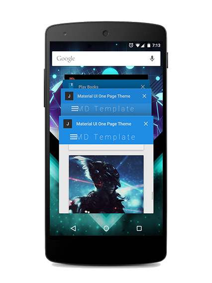

<h1>Material Design One Page HTML Template</h1>

MD One page template is fully responsive and free to use. This HTML template is based on <a href="http://materializecss.com/">Materialize</a>, a CSS Framework based on Material Design.

<a href="https://daojun0690.github.io/material-design-demo/www/">View Demo</a>
 
<h3>Screenshots</h3>
 
 
<h3>Platforms used</h3>
HTML, CSS, JS

<h3>Resources</h3>
<ul>
    <li><a href="http://materializecss.com/">Materialize</a></li>
    <li><a href="http://www.materialpalette.com/">Material Design Colors</a></li>
</ul>

<h2>License</h2>
Material Design One Page HTML Template is licensed under the <a href="http://sam.zoy.org/wtfpl/">WTFPL license</a>.